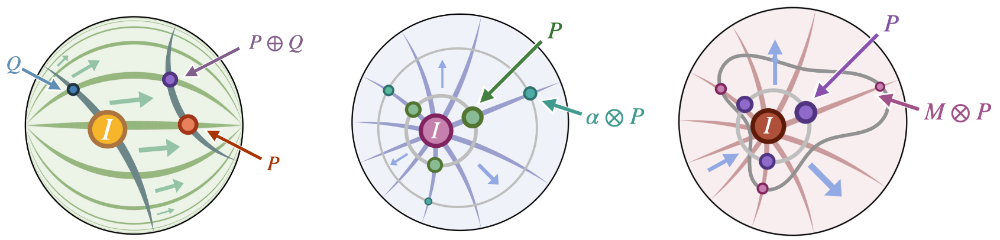

# GyroSPD
Code for the paper ["Vector-valued Distance and Gyrocalculus on the Space of Symmetric Positive Definite Matrices"](https://arxiv.org/abs/2110.13475) 
accepted at NeurIPS 2021.

<p align="middle">
  
</p>

## Requirements
 - Python == 3.7 
 - Pytorch == 1.5.1: ```conda install pytorch==1.5.1 torchvision==0.6.1 [cpuonly | cudatoolkit=10.2] -c pytorch```. 
 - [Geoopt](https://github.com/geoopt/geoopt) == 0.3.1: install from repository is advised
 - tensorboardx
 - tqdm

## Running experiments

### 0. Init repo
```sh init.sh```
 
It will uncompress the Knowledge graphs and create the necessary folders.
Datasets are taken from https://github.com/villmow/datasets_knowledge_embedding

### 1. Preprocess Dataset

```python preprocess.py```

This will preprocess all folders inside the `data` folder. 
It looks for "train", "valid", "test" files in tsv format with triples of 
_"head    relation    tail"_


### 2. Run Experiments

```
python -m torch.distributed.launch --nproc_per_node=N_CPUS --master_port=2055 train.py \\
            --n_procs=N_CPUS \\
            --data=PREP \\
            --run_id=RUN_ID \\
            --results_file=out/results.csv \\
            --model=MODEL \\
            --metric=riem \\
            --dims=10 \\
            --learning_rate=1e-4 \\
            --val_every=25 \\
            --patience=50 \\
            --batch_size=2048 \\
            --epochs=1000 \\
            --train_bias
```

Experiments can be run distributed over multiple CPUs/GPUs with `N_CPUS`. 
`PREP` must be the name of the folder inside `data`.
Results will be reported in `results_file` with `run_id` as the name.
For `model` and `metric` see [Models and Metrics](#models-and-metrics)


## Models and Metrics

The parameter `--model` can be set with:

- `tgspd`: Applies a scaling on the head embedding
- `tgrotspd`: Applies a rotation on the head embedding
- `tgrefspd`: Applies a reflection on the head embedding
- `tgattnspd`: Combines rotation and reflection with an attention mechanism

The parameter `--metric` can be set with:

 - `riem`: Riemannian metric
 - `fone`: Finsler One
 - `finf`: Finsler Infinity

## TODO
- [ ] Migrate to latest pytorch
- [ ] Remove geoopt dependency / Migrate to latest geoopt 


## Citation
The source code and data in this repository aims at facilitating the study of graph embeddings in 
the space of symmetric positive definite matrices. 
If you use the code/data, please cite it as follows:
```
@misc{lopez2021gyrospd,
      title={Vector-valued Distance and Gyrocalculus on the Space of Symmetric Positive Definite Matrices}, 
      author={Federico L{\'o}pez and Beatrice Pozzetti and Steve Trettel and Michael Strube and Anna Wienhard},
      year={2021},
      eprint={2110.13475},
      archivePrefix={arXiv},
      primaryClass={cs.LG}
}
```
